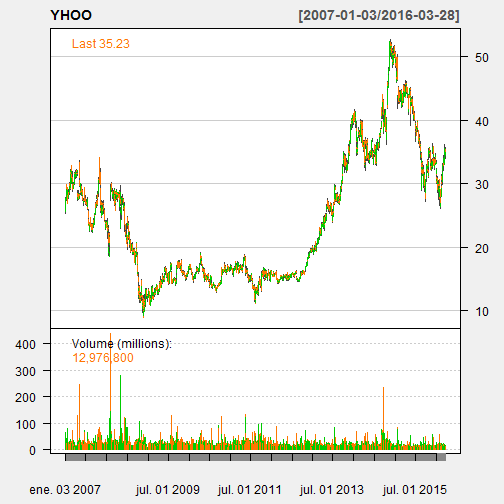
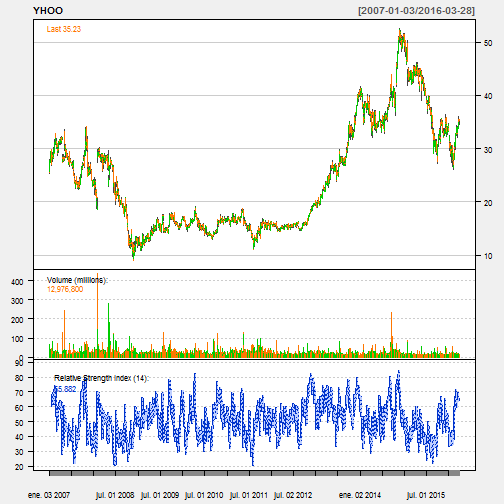
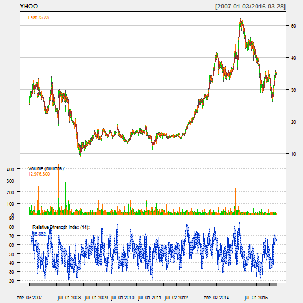
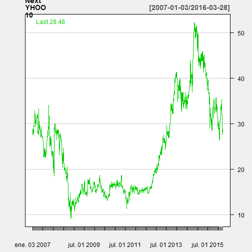

## What's App!

Here is the Stock loader an easy app to download and visualize Stocks on your computer
The following slides contain

> 1. How to use it
> 2. How to make predictions
> 3. Download content

This app is very intuitive to use. Simply choose the Symbol you want to visualize.
Add a time period and indicators to plan your strategy.
Finally make predictions to see if your strategy aligns with a predictive model.

---
## How to use it 

Choose one of the Symbols in the of the Dow Jones and choose a time period from the left hand side. A graph like this will show up

[1] "YHOO"

---
## How to use it 2

Click on the checkboxes to add indicators and add it directly to the graph. Also choose one of the different options to see the graph using candlesticks, bars, lines (close)...

[1] "YHOO"

---

## Make Predictions
Click on the prediction tab to make predictions. Use the slider on the bottom left side to choose the number of periods (days) to make your forecast on.

[1] "YHOO"

---

## Download Content

Finally click on Download button to download the data of the stock to make your own analysis in csv format!!

Thanks
Alvaro Aguado

---

